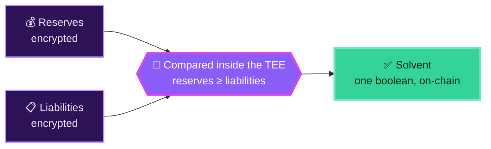
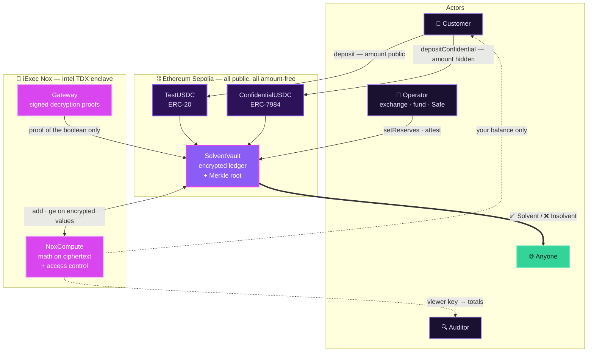
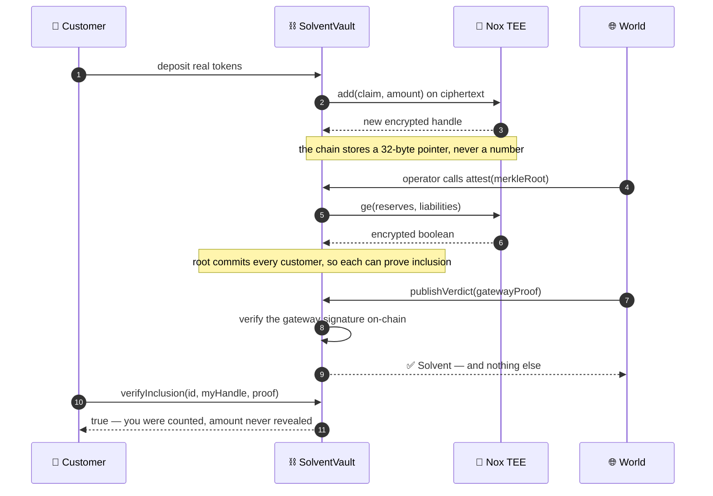

<div align="center">


# Solvent

### Prove you hold more than you owe — without revealing a single number.

[](https://solvent-psi.vercel.app)
[](https://sepolia.etherscan.io/address/0xDb72f13b746c326F0f2291483A3979eFb6cA932b#code)
[](https://docs.noxprotocol.io)
[](#testing)
[](LICENSE)

**[Open the live app →](https://solvent-psi.vercel.app)**

</div>

---

## The 10-second version

After FTX, everyone demands that exchanges **prove reserves exceed liabilities**.

The catch: an honest proof leaks the entire book — every customer's balance, every position. So firms publish nothing, or a PDF you simply have to believe.

**Solvent removes the trade-off.** The comparison runs inside a hardware-secured enclave on data that is never decrypted, and the only thing that ever becomes public is one bit:



Nobody learns the amounts. Everybody can verify the verdict.

---

## How it works



### The proof, step by step



---

## Who sees what

| | Sees | Cannot see |
|---|---|---|
| 🌐 **Public** | The verdict, addresses, attestation ids, block numbers | **Any amount, ever** |
| 👤 **Customer** | Their own balance + proof they were counted | Anyone else's balance, the totals |
| 🔍 **Auditor** | The real totals, via a Nox viewer key | Individual customer balances |
| 🏦 **Operator** | Their own reserves and total liabilities | Nothing extra — no special decryption of customers |

**No plaintext amount ever appears on-chain.** Events carry addresses and ids only — go read them on Etherscan and check.

---

## What makes it more than a demo

🌳 **Proof of inclusion.** A boolean alone means *"trust that they counted me."* At attestation time the vault commits a Merkle root over `(customer, encrypted-handle)` leaves. Any client rebuilds the identical tree from public state and proves **their own** balance was inside the attested liabilities — revealing nothing. That's the difference between trusting the number and verifying it.

🙈 **Confidential deposits (ERC-7984).** The `depositConfidential` path encrypts the amount client-side and pulls it with `confidentialTransferFrom`, so the deposit size never appears in calldata or events — not even at the token layer. Only the faucet mint, the on-ramp analogue, is public.

🛡️ **Hardened.** `ReentrancyGuard` on token-moving paths, custom errors, capped mints so the encrypted liability accumulator can't be griefed or overflowed, and an `attest` guard that refuses to publish a vacuous verdict before reserves exist. 23 local tests plus a live Sepolia integration script covering the full encrypted flow.

🧩 **Composable.** All encrypted math, comparison and access control come from the audited [`Nox`](https://www.npmjs.com/package/@iexec-nox/nox-protocol-contracts) library — Solvent adds **no cryptography of its own** and **modifies no underlying protocol**. The operator can be a Safe multisig; Solvent layers confidential proofs on top of an unmodified treasury.

---

## Live deployment

**App:** https://solvent-psi.vercel.app — all three contracts verified on Sepolia Etherscan.

| Contract | Address |
| --- | --- |
| `SolventVault` | [`0xDb72f13b746c326F0f2291483A3979eFb6cA932b`](https://sepolia.etherscan.io/address/0xDb72f13b746c326F0f2291483A3979eFb6cA932b#code) |
| `TestUSDC` (tUSDC) | [`0x1FA49cc3E1e6ae3D8A717eD36C7426bC58883255`](https://sepolia.etherscan.io/address/0x1FA49cc3E1e6ae3D8A717eD36C7426bC58883255#code) |
| `ConfidentialUSDC` (cUSDC, ERC-7984) | [`0xe4393Cb1834F0812D2c514f8C1920b56fd1b90F9`](https://sepolia.etherscan.io/address/0xe4393Cb1834F0812D2c514f8C1920b56fd1b90F9#code) |

Built for the **iExec WTF Hackathon (Summer Edition)**. No mock data — real ERC-20, real TEE, real Sepolia.

---

## Try it in the browser

Sidebar views are **Dashboard**, **Vaults** (customer), **Prove** (operator), **Audit** (auditor).

1. **Vaults** → *Get test USDC* → *Approve & Deposit*. Then *Faucet & confidential deposit* — that amount is hidden even at the token layer, unlike the public path above it.
2. **Prove** → *Set encrypted reserves* → optionally *Credit confidentially* → *Attest solvency* → *Publish verdict*. Reserves must be set first, or `attest` reverts `ReservesNotSet`.
3. **Dashboard** → the verdict reads **Solvent**, every amount still `🔒 encrypted`.
4. **Vaults** → *Decrypt my balance* (only yours) and *Verify my inclusion*. Verify right after publishing — the check uses your **current** claim handle, so a later deposit invalidates it.
5. **Audit** → *Decrypt totals* with the viewer key. Then open the vault on Etherscan and confirm no amounts are visible anywhere.

> Want to see it fail honestly? Deposit past the declared reserves and attest again — the verdict flips to **Insolvent**. A proof system that only ever says yes proves nothing.

---

## Run it yourself

**Prerequisites:** Node.js 20+ · MetaMask · a wallet with [Sepolia test ETH](https://sepoliafaucet.com)

### 1 · Contracts

```bash
cd contracts
npm install
cp .env.example .env        # SEPOLIA_RPC_URL + PRIVATE_KEY (testnet only)
npm run compile
npm test                    # 23 local unit tests, no live Nox needed
npm run deploy:sepolia      # deploys all three, writes frontend/deployments/sepolia.json
npm run smoke:sepolia       # full end-to-end proof on live Sepolia
```

Verify on Etherscan:

```bash
npx hardhat verify --network sepolia <TestUSDC>
npx hardhat verify --network sepolia <ConfidentialUSDC>
npx hardhat verify --network sepolia <SolventVault> <TestUSDC> <operator> <auditor> <ConfidentialUSDC>
```

| Env var | Purpose |
|-----|---------|
| `SEPOLIA_RPC_URL` | Sepolia JSON-RPC endpoint |
| `PRIVATE_KEY` | Deployer / operator key (**testnet only**) |
| `ETHERSCAN_API_KEY` | Optional, for `hardhat verify` |
| `AUDITOR_ADDRESS` | Optional auditor (defaults to deployer) |

### 2 · Frontend

```bash
cd frontend
npm install
npm run dev          # http://localhost:3000
```

Contract addresses are read from `frontend/deployments/sepolia.json`, written by the deploy step. Connect MetaMask on Sepolia.

---

## Testing

```bash
cd contracts
npm test                 # local suite: access control, guards, input bounds, Merkle proofs
npm run coverage         # coverage for the non-encrypted paths
npm run smoke:sepolia    # live: deposit → credit → confidential deposit → setReserves
                         #  → attest(root) → publicDecrypt → publishVerdict → verifyInclusion
npm run dryrun:sepolia   # read-only health check of the live deployment
```

> **Why two tiers?** Nox encrypted operations run in an off-chain TEE reached through the live `NoxCompute` contract, so they cannot execute on a bare local Hardhat node. The local suite covers everything non-encrypted plus the pure-keccak Merkle logic; the Sepolia script proves the encrypted flow against the real gateway.

---

## What Solvent does *not* prove

Worth stating plainly, because it shapes how you should read the verdict.

The **liabilities** side is genuinely proven — computed on-chain from real deposits, committed to a Merkle root, independently verifiable by every customer. The **reserves** side is operator-declared.

So the honest claim is: *Solvent proves the relationship `declared reserves ≥ real liabilities`, confidentially.* It does not by itself prove the operator custodies those reserves. Binding `_reserves` to a Safe's verifiable on-chain holdings is the natural next step.

Full analysis, including the point-in-time nature of inclusion proofs and the deposit-only design, is in **[docs/THREAT_MODEL.md](docs/THREAT_MODEL.md)**.

---

## Repository layout

```
solvent/
├── contracts/            # Hardhat (Solidity 0.8.35, evmVersion cancun)
│   ├── contracts/        # SolventVault · TestUSDC · ConfidentialUSDC (ERC-7984)
│   ├── scripts/          # deploy · smoke · dryrun
│   └── test/             # 23 local tests, no live Nox needed
├── frontend/             # Next.js App Router · ethers v6 · @iexec-nox/handle
│   ├── app/  components/  lib/     # lib/merkle.ts rebuilds the tree client-side
│   └── deployments/sepolia.json    # written by deploy
├── docs/                 # ARCHITECTURE.md · THREAT_MODEL.md
├── feedback.md           # honest feedback on the iExec Nox tooling
└── DEMO_SCRIPT.md
```

## Tech

- **Contracts** — Solidity 0.8.35 · `@iexec-nox/nox-protocol-contracts` · `@iexec-nox/nox-confidential-contracts` (ERC-7984) · OpenZeppelin (MerkleProof, ReentrancyGuard) · Hardhat (`cancun`)
- **Frontend** — Next.js 14 · TypeScript · ethers v6 · `@iexec-nox/handle` · `@openzeppelin/merkle-tree`
- **Network** — Ethereum Sepolia · NoxCompute [`0x24Ef36Ec…F0F77bF`](https://sepolia.etherscan.io/address/0x24Ef36Ec5b626D7DCD09a98F3083c2758F0F77bF)

---

<div align="center">

**MIT** © [coderansari](https://github.com/coderansari)

</div>
